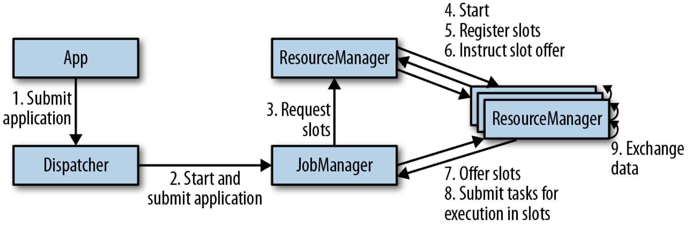
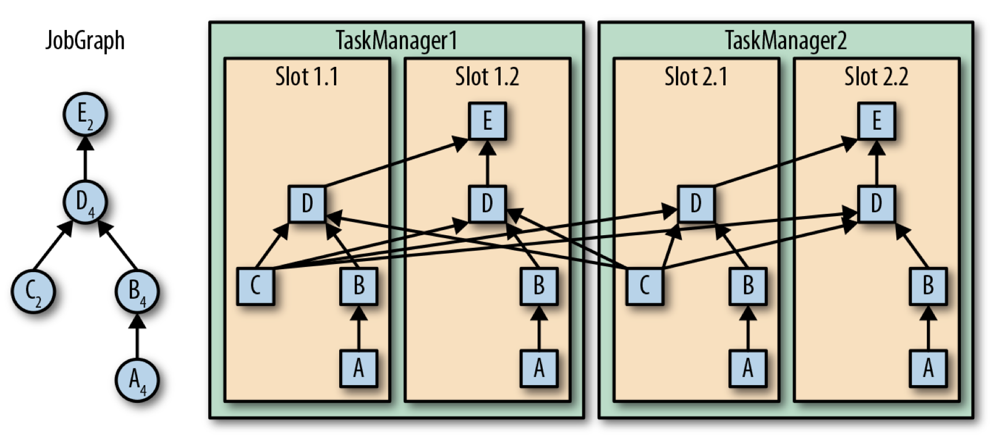

## Architecture

- JobManager：将 JobGraph 转换为 physical dataflow graph ExecutionGraph
  - ExecutionGraph consists of tasks that can be executed in parallel
  - it requests the necessary resources (TaskManager slots) to execute the tasks from the `ResourceManager`
  - it distributes the tasks of the ExecutionGraph to the `TaskManagers` that execute them
- ResourceManager：responsible for managing TaskManager slots
  - When a JobManager requests TaskManager slots, the ResourceManager instructs a TaskManager with idle slots to offer them to the JobManager
- TaskManagers：the worker processes of Flink，each TaskManager provides a certain number of slots
- Dispatcher：provides a REST interface to submit applications for execution

Flink's components

## Task Execution

These tasks can be subtasks of the same operator (data parallelism), a different operator (task parallelism), or even from a different application (job parallelism).

Flink Task Execution

